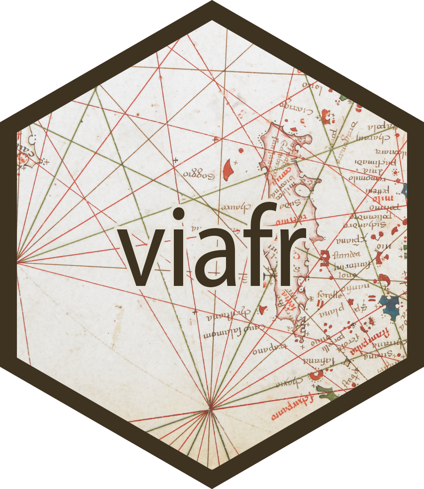

<!-- README.md is generated from README.Rmd. Please edit that file -->

```{r, include = FALSE}
knitr::opts_chunk$set(
	collapse = TRUE,
	comment = "#>",
	fig.path = "man/figures/README-",
	out.width = "100%"
)

options(width = "100")

require(magrittr)
require(viafr)
```

# viafr 


## Overview

This R package is forked from Stefanie Schneider's original viafr package at [GitHub](https://github.com/stefanieschneider/viafr).
The objective is to extend the original package to enable discovery of social networks of coauthors from VIAF clusters. 
VIAF is an OCLC service that combines multiple LAM (Library, Archive, and Museum) name authority files into a single name authority service.
It thus provides direct access to linked names for the same entity across the world's major name authority files, including national and regional
variations in language, character set, and spelling. For more information go to [VIAF](https://viaf.org/).

This R package uses the VIAF (Virtual International Authority File) API. 

## Installation

You can install the original released version of viafr from [CRAN](https://CRAN.R-project.org) with:

``` r
install.packages("viafr")
```

To install this development version from [GitHub](https://github.com/kijinosu/viafr) use:

``` r
# install.packages("devtools")
devtools::install_github("kijinosu/viafr")	
```


## Contributing

Please report issues, feature requests, and questions to the [GitHub issue tracker](https://github.com/stefanieschneider/viafr/issues). We have a [Contributor Code of Conduct](https://github.com/stefanieschneider/viafr/blob/master/CODE_OF_CONDUCT.md). By participating in viafr you agree to abide by its terms.
